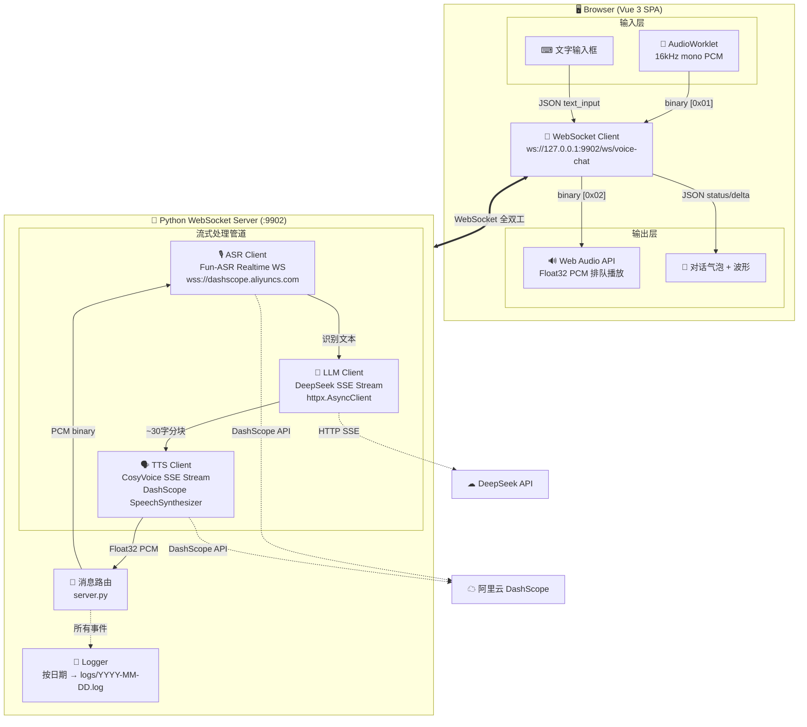
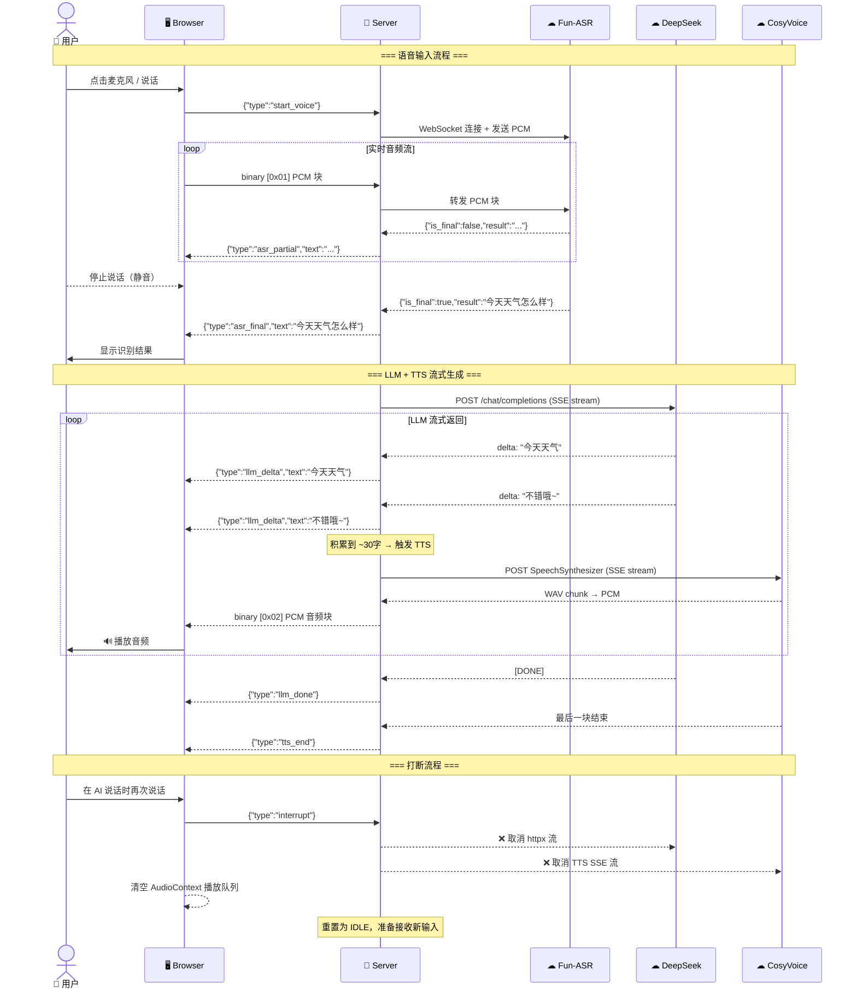
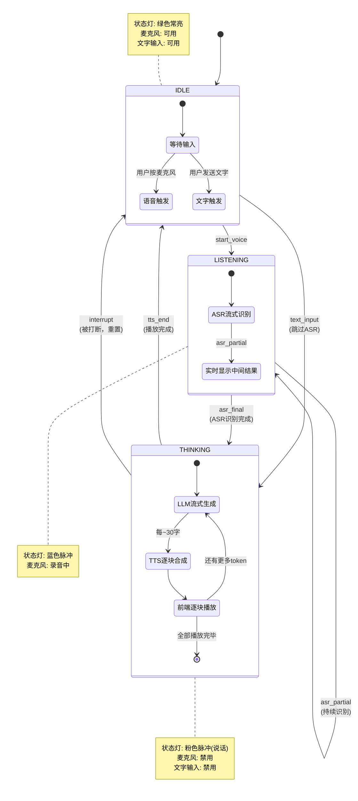

# Real-time-voice 实时语音对话 Web 应用 — 技术方案

## Context

构建一个浏览器端的实时语音对话应用，实现：**麦克风/文字输入 → Fun-ASR 流式识别 → LLM 流式回复 → CosyVoice-v3 流式合成 → 浏览器播放**。全部采用流式传输以降低首包延迟，实现接近实时的对话体验。

前端采用 **二次元角色风格**，以虚拟角色 Yuki 为主题，打造沉浸式 AI 语音对话界面。

## 技术栈

| 层 | 技术 | 说明 |
|---|---|---|
| 前端框架 | Vue 3 (Composition API) + Vite | 纯静态 SPA |
| 前端 UI | 自定义 CSS3 | 二次元角色风格，毛玻璃面板，粒子动效 |
| 前端音频 | Web Audio API + AudioWorklet | 低延迟麦克风捕获 + 流式播放 |
| 通信协议 | WebSocket (全双工) | 前后端单一长连接 |
| 后端框架 | Python `websockets` + `httpx` | 异步 IO |
| ASR | 阿里云 Fun-ASR Realtime (DashScope WebSocket) | 流式识别，带 VAD 自动断句 |
| LLM | DeepSeek API (HTTP SSE streaming) | 流式文本生成 |
| TTS | 阿里云 CosyVoice-v3 (HTTP SSE streaming) | **独立重写，不复用 tts_server.py** |

## 前端 UI 设计

### 整体风格

**暗色二次元主题** — 深蓝紫渐变背景 + 星空粒子 + 毛玻璃面板 + 角色立绘 + 霓虹光效。

### 页面布局

```
┌──────────────────────────────────────────────────────────┐
│  背景：深空渐变 + 飘浮粒子 + 星空                           │
│                                                          │
│  ┌────────────────────────────────────────────────────┐  │
│  │           Header: 角色名 + 状态指示灯 + 设置⚙        │  │
│  ├──────────────────────┬─────────────────────────────┤  │
│  │                      │                             │  │
│  │   角色立绘区          │   对话气泡区                  │  │
│  │                      │                             │  │
│  │   ┌─────────┐       │   ┌─────────────────────┐   │  │
│  │   │  Yuki    │       │   │ "你好呀哥哥~"        │   │  │
│  │   │  立绘    │       │   └─────────────────────┘   │  │
│  │   │  (随状态 │       │                             │  │
│  │   │  变化)   │       │   ┌─────────────────────┐   │  │
│  │   └─────────┘       │   │      用户消息 ──────▶│   │  │
│  │                      │   └─────────────────────┘   │  │
│  │  [好感度: ████░]     │                             │  │
│  │  [信任度: ███░░]     │  [ASR 实时识别文字...]      │  │
│  │                      │                             │  │
│  ├──────────────────────┴─────────────────────────────┤  │
│  │  底部控制栏                                         │  │
│  │  ┌────────────────────────────┐  ┌────┐ ┌────┐   │  │
│  │  │  文字输入框                  │  │ 🎤 │ │ ⚙  │   │  │
│  │  └────────────────────────────┘  └────┘ └────┘   │  │
│  │  语音波形可视化 (CSS 柱状动画)                       │  │
│  └────────────────────────────────────────────────────┘  │
│                                                          │
│  ┌─ 设置面板 (浮层，点击 ⚙ 滑出，两个分页) ─────────────┐  │
│  │  ┌─ Tab: [语音设置] [模型与密钥] ─────────────────┐  │  │
│  │  │                                                │  │  │
│  │  │  【语音设置 页】                                 │  │  │
│  │  │  音色选择: [下拉列表，从 API 获取]                 │  │  │
│  │  │  语气提示词: [文本输入框]                         │  │  │
│  │  │  麦克风设备: [下拉列表，enumerateDevices]         │  │  │
│  │  │  麦克风开关: [Toggle]                            │  │  │
│  │  │                                                │  │  │
│  │  │  【模型与密钥 页】                               │  │  │
│  │  │  ASR 模型: [下拉选择，当前 Fun-ASR]              │  │  │
│  │  │  ASR API Key: [密码输入框]                      │  │  │
│  │  │  LLM 模型: [下拉选择，当前 DeepSeek]            │  │  │
│  │  │  LLM API Key: [密码输入框]                      │  │  │
│  │  │  LLM Base URL: [文本输入框]                     │  │  │
│  │  │  TTS 模型: [下拉选择，当前 CosyVoice]           │  │  │
│  │  │  TTS API Key: [密码输入框]                      │  │  │
│  │  └────────────────────────────────────────────────┘  │  │
│  └────────────────────────────────────────────────────┘  │
└──────────────────────────────────────────────────────────┘
```

### 核心视觉元素

| 元素 | 设计说明 |
|---|---|
| **背景** | 深蓝紫渐变 (`#0a0a1a` → `#1a1040` → `#0d1b3e`)，CSS 生成星空粒子 |
| **角色立绘** | 左侧固定区域，SVG/CSS 角色形象，说话时带呼吸光晕脉冲动画 |
| **对话气泡** | 毛玻璃 (`backdrop-filter: blur`)，角色消息粉色渐变边框，用户消息蓝色边框 |
| **状态指示灯** | Header 中角色头像旁：绿色=待机，蓝色脉冲=聆听，橙色脉冲=思考，粉色脉冲=说话 |
| **语音波形** | 底部 CSS 柱状动画，录音时随音量跳动，AI 说话时不同颜色 |
| **好感度条** | 角色立绘下方，粉色渐变，根据 `<好感变化:+X>` 动态更新 |
| **设置面板** | 右侧滑出抽屉，毛玻璃背景，两个分页 Tab：语音设置 + 模型与密钥 |

### 动效设计

| 动效 | 实现 |
|---|---|
| 粒子背景 | CSS `@keyframes` 飘浮，20-30 个半透明圆点 |
| 角色呼吸光晕 | `box-shadow` + `animation: pulse 3s ease-in-out infinite` |
| 说话时立绘 | `transform: scale(1.02)` + 光晕增强 |
| 对话气泡 | `animation: fadeInUp 0.3s ease` |
| 波形柱 | 实时音量数据更新 CSS `height`，transition 平滑 |
| 按钮悬停 | `transform: scale(1.05)` + 辉光扩散 |
| 设置面板 | `transform: translateX()` 滑入滑出 |

## 设置面板详细设计

点击 Header 右侧 ⚙ 图标按钮 → 右侧滑出设置面板（毛玻璃抽屉，宽度 ~360px）。

### 分页结构

设置面板顶部有两个 Tab 标签切换：

| Tab | 内容 |
|---|---|
| **语音设置** | TTS 音色、语气提示词、麦克风设备、麦克风开关 |
| **模型与密钥** | ASR/LLM/TTS 模型选择、对应 API Key、Base URL |

### 语音设置 页

| 设置项 | 组件类型 | 说明 |
|---|---|---|
| **TTS 音色** | `<select>` 下拉 | 从后端 `/api/voices` 获取可用音色列表（系统音色 + 复刻音色），选中项高亮显示音色名称 |
| **语气提示词** | `<textarea>` | 传给 TTS 的 instruction 参数，如"用温柔撒娇的语气说"，留空使用默认 |
| **麦克风设备** | `<select>` 下拉 | `navigator.mediaDevices.enumerateDevices()` 列出音频输入设备，显示设备 label |
| **麦克风开关** | Toggle 开关 | 控制麦克风采集启用/禁用，关闭时只能文字输入，麦克风按钮隐藏 |

### 模型与密钥 页

| 设置项 | 组件类型 | 说明 |
|---|---|---|
| **ASR 模型** | `<select>` 下拉 | 当前可选：Fun-ASR (fun-asr-realtime)，预留扩展 |
| **ASR API Key** | `<input type="password">` | DashScope API Key，默认从 `.env` 读取 `ASR_API_KEY` |
| **LLM 模型** | `<select>` 下拉 | 当前可选：DeepSeek (deepseek-v4-flash)，预留扩展 |
| **LLM API Key** | `<input type="password">` | LLM API Key，默认从 `.env` 读取 `LLM_API_KEY` |
| **LLM Base URL** | `<input type="text">` | LLM API 地址，默认 `https://api.deepseek.com` |
| **TTS 模型** | `<select>` 下拉 | 当前可选：CosyVoice v3.5 Flash / v3 Flash / v3 Plus 等，预留扩展 |
| **TTS API Key** | `<input type="password">` | DashScope API Key，默认从 `.env` 读取 `QWEN_TTS_API_KEY` |

### 设置持久化

- 所有设置项保存在 `localStorage`，页面加载时恢复
- API Key 使用 `password` 类型输入框，掩码显示
- 若用户填写了 API Key 则使用用户填写的，否则回退到 `.env` 中的默认值
- 模型/密钥变更后，通过 `update_config` WebSocket 消息同步到后端（后端动态更新 API 配置）
- 音色列表每次打开设置面板时从后端实时获取

## 输入模式

用户可通过两种方式输入：

1. **语音输入**（默认）：点击麦克风按钮开始录音 → ASR 识别 → 自动触发 LLM 回复
2. **文字输入**：在底部输入框输入文字 → 按 Enter 或点击发送按钮 → 直接触发 LLM 回复（跳过 ASR）

两者互斥：语音录音中时文字输入框禁用，文字发送过程中麦克风按钮禁用。

## 架构流程图



## 数据流时序图



## WebSocket 消息协议

### 上行（Browser → Server）

| type | 格式 | 说明 |
|---|---|---|
| `start_voice` | `{"type":"start_voice","sample_rate":16000}` | 开始语音输入 |
| `stop_voice` | `{"type":"stop_voice"}` | 结束语音输入 |
| `audio` | binary: `[0x01] + PCM 16bit mono` | 麦克风音频块 |
| `text_input` | `{"type":"text_input","text":"..."}` | 文字输入（跳过 ASR） |
| `interrupt` | `{"type":"interrupt"}` | 打断当前 AI 回复 |
| `update_config` | `{"type":"update_config","voice":"...","instruction":"...","asr_model":"...","asr_api_key":"...","llm_model":"...","llm_api_key":"...","llm_base_url":"...","tts_model":"...","tts_api_key":"..."}` | 更新配置（语音+模型+密钥） |

### 下行（Server → Browser）

| type | 格式 | 说明 |
|---|---|---|
| `asr_partial` | `{"type":"asr_partial","text":"..."}` | ASR 中间结果 |
| `asr_final` | `{"type":"asr_final","text":"..."}` | ASR 最终结果 |
| `llm_delta` | `{"type":"llm_delta","text":"..."}` | LLM 增量文本 |
| `llm_done` | `{"type":"llm_done"}` | LLM 回复结束 |
| `tts_start` | `{"type":"tts_start","sample_rate":24000}` | TTS 流开始 |
| `tts_audio` | binary: `[0x02] + Float32 PCM` | TTS 音频块 |
| `tts_end` | `{"type":"tts_end"}` | TTS 音频流结束 |
| `status` | `{"type":"status","state":"listening/thinking/speaking/idle"}` | 角色状态变更 |
| `emotion` | `{"type":"emotion","affection":3,"trust":2}` | 好感/信任变化 |
| `error` | `{"type":"error","message":"..."}` | 错误信息 |

## 后端模块设计（全部在 Real-time-voice/ 下独立重写）

### 1. ASR 模块 (`asr_client.py`)

- DashScope Fun-ASR Realtime WebSocket 协议
- URL: `wss://dashscope.aliyuncs.com/api/v1/services/audio/asr/realtime?token={api_key}`
- 上行：转发浏览器 16kHz 16bit mono PCM
- 下行解析 DashScope JSON:
  ```json
  {"header": {"task_id": "xxx"}, "payload": {"result": "识别文本", "is_final": true}}
  ```
- `is_final=false` → 发 `asr_partial`（前端实时显示）
- `is_final=true` → 发 `asr_final`，文本送入 LLM

### 2. LLM 模块 (`llm_client.py`)

- 使用 `httpx.AsyncClient` 发起 POST SSE 流式请求
- 解析 `data: {...}` chunk → 提取 `choices[0].delta.content`
- 每个 token 发送 `llm_delta`
- 积累到 ~30 字或遇标点（，。！？）触发 TTS 分块
- 使用项目 `.env` 中的 `LLM_API_KEY` / `LLM_BASE_URL` / `LLM_MODEL`
- 复用 Yuki 角色 System Prompt + 会话上下文管理（参考 tts_server.py 逻辑但独立实现）

### 3. TTS 模块 (`tts_client.py`)

**完全独立重写，不 import tts_server.py。**

- DashScope CosyVoice HTTP SSE 流式合成
- URL: `https://dashscope.aliyuncs.com/api/v1/services/audio/tts/SpeechSynthesizer`
- Header: `X-DashScope-SSE: enable`
- 请求体: `{"model": "...", "input": {"text": "...", "voice": "...", "format": "wav", "sample_rate": 24000}}`
- 解析 SSE → base64 解码 WAV 块 → 提取 PCM → 发送 Float32 binary 给浏览器
- 支持 `instruction` 参数（语气提示词）
- 支持音色列表查询：`POST /api/v1/services/audio/tts/customization` action=list_voice

### 4. API 路由模块 (`api_voices.py`)

- HTTP GET 端点：返回可用 TTS 音色列表
- 合并系统音色（`QWEN_TTS_VOICES_BY_MODEL`）+ API 查询的复刻音色
- 格式：`[{"value": "longxiaochun_v3", "label": "龙小淳（知性积极女）"}, ...]`

### 5. 日志模块 (`logger.py`)

**独立的日志系统**，将所有终端输出同时写入日志文件：

- 日志目录：`Real-time-voice/logs/`
- 文件名格式：`YYYY-MM-DD.log`（如 `2026-04-30.log`）
- 同一天日志追加到同一文件，跨天自动创建新文件
- 日志格式：`[HH:MM:SS] [LEVEL] message`
- 日志级别：`DEBUG` / `INFO` / `WARN` / `ERROR`
- 同时输出到终端（stdout/stderr）和日志文件
- 实现方式：自定义 `logging.Handler`，按日期轮转文件名

```
Real-time-voice/logs/
├── 2026-04-29.log
├── 2026-04-30.log
└── 2026-05-01.log
```

### 6. 主服务 (`server.py`)

- WebSocket 主循环：解析上行消息 → 路由到 ASR/LLM/TTS 管道
- 打断逻辑：`interrupt` → 取消 httpx 请求 + 清空状态
- 同时 serve 前端静态文件（Vue build 产物）
- 提供 HTTP API：`/api/voices`
- 启动时初始化日志系统，所有模块使用统一 logger

## 目录结构

```
Real-time-voice/
├── server.py              # WebSocket + HTTP 服务主入口
├── asr_client.py          # Fun-ASR Realtime WebSocket 封装
├── llm_client.py          # LLM SSE 流式调用 + 会话上下文
├── tts_client.py          # CosyVoice SSE 流式 + 音色查询（独立重写）
├── logger.py              # 日志系统（按日期写入 logs/ 目录）
├── requirements.txt       # websockets, httpx
├── logs/                  # 日志文件目录（自动创建）
│   ├── 2026-04-29.log
│   └── 2026-04-30.log
└── frontend/              # Vue 3 + Vite 项目
    ├── index.html
    ├── package.json
    ├── vite.config.js
    ├── src/
    │   ├── main.js
    │   ├── App.vue
    │   ├── components/
    │   │   ├── CharacterPanel.vue    # 角色立绘 + 好感度条 + 状态灯
    │   │   ├── ChatBubbles.vue       # 对话气泡列表
    │   │   ├── VoiceWaveform.vue     # 实时语音波形（CSS 柱状动画）
    │   │   ├── ControlBar.vue        # 底部：文字输入框 + 麦克风按钮 + 发送按钮
    │   │   ├── SettingsPanel.vue     # 设置抽屉面板（新）
    │   │   └── ParticleBg.vue        # 星空粒子背景
    │   ├── composables/
    │   │   ├── useWebSocket.js       # WebSocket 连接 + 消息收发
    │   │   ├── useMicrophone.js      # AudioWorklet 麦克风采集 + 设备枚举
    │   │   ├── useAudioPlayer.js     # Web Audio API 排队播放
    │   │   └── useSettings.js        # 设置状态 + localStorage（语音设置 + 模型密钥）
    │   └── assets/
    │       └── yuki.svg              # 角色立绘 SVG
    └── public/
```

## Vue 组件 Props/Events 约定

### SettingsPanel.vue

```
Props:
  - visible: Boolean              // 是否显示
  - voices: Array<{value,label}>  // 可用音色列表
  - currentVoice: String          // 当前音色
  - currentInstruction: String    // 当前语气提示词
  - currentDeviceId: String       // 当前麦克风设备ID
  - micEnabled: Boolean           // 麦克风开关
  - audioDevices: Array<{deviceId,label}>  // 可用音频设备
  - modelConfig: {                // 模型与密钥配置
      asr_model: String,
      asr_api_key: String,
      llm_model: String,
      llm_api_key: String,
      llm_base_url: String,
      tts_model: String,
      tts_api_key: String,
    }

Events:
  @close                         // 关闭面板
  @update:voice                  // 音色变更
  @update:instruction            // 语气提示词变更
  @update:device                 // 麦克风设备变更
  @update:mic-enabled            // 麦克风开关变更
  @update:model-config           // 模型与密钥配置变更 {key, value}
```

### ControlBar.vue

```
Props:
  - isRecording: Boolean      // 是否正在录音
  - isPlaying: Boolean        // AI 是否在说话
  - micEnabled: Boolean       // 麦克风是否启用
  - disabled: Boolean         // 全局禁用

Events:
  @send-text                  // 发送文字消息 {text}
  @start-voice                // 开始录音
  @stop-voice                 // 停止录音
  @open-settings              // 打开设置面板
```

## 关键设计决策

1. **TTS 模块独立重写**：不在 Real-time-voice 中 import opc_cli 的任何模块。所有 TTS 逻辑（SSE 流式合成、音色查询、WAV 解析）在 `Real-time-voice/tts_client.py` 中从零实现。API Key 从 `.env` 直接读取（通过 `python-dotenv`，硬编码路径指向项目根 `.env`）。

2. **Microphone 设备枚举**：使用 `navigator.mediaDevices.enumerateDevices()` 获取音频输入设备列表，用户可在设置面板中选择。

3. **麦克风开关**：Toggle 控制，关闭时隐藏麦克风按钮，只能文字输入。状态持久化到 localStorage。

4. **设置面板**：右侧滑出抽屉（宽度 ~340px），毛玻璃背景。音色列表打开时从后端实时获取。所有设置项实时生效，通过 `update_config` 消息同步到后端。

5. **双输入模式**：语音输入和文字输入互斥。文字输入直接发 `text_input` 消息跳过 ASR 阶段，后端直接送入 LLM。

6. **打断（Barge-in）**：用户语音输入或点击打断时，`interrupt` 消息 → 后端取消正在进行的 httpx LLM 请求和 TTS SSE 流 → 清空前端 AudioContext 播放队列 → 重置状态。

## 时序逻辑与打断规则

系统定义 4 个阶段状态，各阶段对用户输入的处理规则不同：

### 状态机



### 打断规则矩阵

| 当前阶段 | 用户行为 | 系统响应 |
|---|---|---|
| **IDLE** | 按麦克风/说话 | 进入 LISTENING，开始 ASR |
| **IDLE** | 发文字 | 直接进入 THINKING（跳过 ASR） |
| **LISTENING** | 继续说话 | 正常，继续 ASR 流式识别 |
| **LISTENING** | 发文字 | 忽略（语音优先，等待 ASR final） |
| **THINKING** | 用户开始说话 | **触发打断** → 执行下方打断流程 |
| **THINKING** | 发文字 | **触发打断** → 执行下方打断流程 |

### 打断流程（详细）

当 THINKING 阶段收到新输入时，按以下顺序执行：

```
  用户说话/发文字
       │
       ▼
  ┌─ 1. 前端 ─────────────────────────────────────────────────┐
  │  a. 发送 {"type":"interrupt"} 到后端                       │
  │  b. 清空 AudioContext 播放队列（已排队的 PCM 块全部丢弃）     │
  │  c. 停止当前音频播放，AudioContext.suspend() → close()      │
  │  d. 对话气泡中，AI 未说完的内容标记为灰色（表示被打断）        │
  │  e. UI 状态灯切为 LISTENING                               │
  └───────────────────────────────────────────────────────────┘
       │
       ▼
  ┌─ 2. 后端 ─────────────────────────────────────────────────┐
  │  a. 收到 interrupt → 取消正在进行的 LLM httpx 流式请求       │
  │     （httpx.CancelError / 手动 close stream）              │
  │  b. 取消正在进行的 TTS SSE 请求（关闭 httpx 连接）           │
  │  c. 清空待发送的 TTS 音频块队列                             │
  │  d. 发送 {"type":"status","state":"idle"} 给前端           │
  │  e. 准备接收新的语音流 或 文字输入                           │
  └───────────────────────────────────────────────────────────┘
       │
       ▼
  ┌─ 3. 开始处理新输入 ────────────────────────────────────────┐
  │  语音输入：重新开始 ASR → LLM → TTS 流程                    │
  │  文字输入：直接开始 LLM → TTS 流程                          │
  └───────────────────────────────────────────────────────────┘
```

### 关键约束

- **已合成的音频不撤回**：打断前已经发送到浏览器的音频块如果还没播放，在步骤 1b 中丢弃；如果正在播放中的那个块，让它自然播完（通常只有几十毫秒）
- **LLM 上下文不丢失**：打断前的对话历史保留在 `_chat_contexts` 中，新消息追加到历史后面，AI 知道对话被中断
- **TTS 队列彻底清空**：后端 `asyncio.Queue` 中排队待合成的文本块全部丢弃，不再发起新的 TTS 请求

## 实施步骤

1. 创建 `Real-time-voice/` 目录结构
2. 初始化 Vite + Vue 3 前端项目
3. 实现 6 个 Vue 组件（ParticleBg → CharacterPanel → ChatBubbles → VoiceWaveform → ControlBar → SettingsPanel）
4. 实现 4 个 composables（useWebSocket → useMicrophone → useAudioPlayer → useSettings）
5. 编写后端 `logger.py`（按日期日志文件 + 终端双输出）
6. 编写后端 `tts_client.py`（CosyVoice SSE 流式 + 音色查询）
7. 编写后端 `asr_client.py`（Fun-ASR WebSocket）
8. 编写后端 `llm_client.py`（DeepSeek SSE + 会话上下文）
9. 编写后端 `server.py`（主 WebSocket 服务 + HTTP API + 静态文件 + 日志初始化）
10. 联调端到端流程
11. 验证：语音输入 / 文字输入 / 设置面板 / 打断 / 设备切换 / 日志文件检查

## 验证方式

1. 启动后端：`cd Real-time-voice && python server.py --port 9902`
2. 启动前端：`cd frontend && npm run dev`
3. 浏览器打开 Vite 开发地址
4. 测试语音输入：点击麦克风 → 说话 → ASR 文本显示 → LLM 气泡 + TTS 播放
5. 测试文字输入：输入文字 → 发送 → LLM 气泡 + TTS 播放
6. 测试设置面板：切换音色 → 输入语气提示词 → 验证效果
7. 测试麦克风设备切换 + 麦克风开关
8. 测试打断：AI 说话时点击麦克风/发送新消息
9. 延迟目标：ASR 首包 < 500ms，LLM 首 token < 1s，TTS 首包 < 2s
